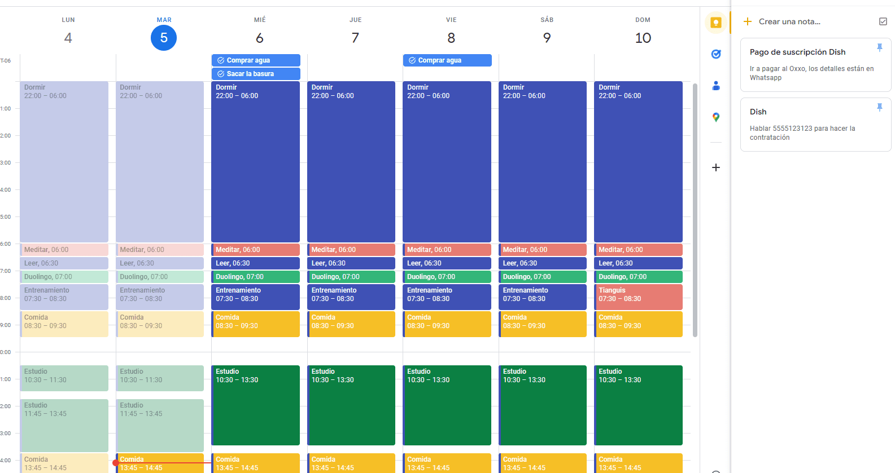

# Curso de Gestión Efectiva del Tiempo

Domina técnicas de organización del tiempo, aprende las bases necesarias para priorizar tus tareas y acelera tu crecimiento profesional.

> **Beatriz Ibáñez**  
> *Product Manager en Blackboard*

---

## Proyecto

En este curso aprendí por qué es importante gestionar el recurso más importante que tenemos las personas, **el tiempo**. Comencé por entender qué es lo que implica y lo que no implica. Después tuve la oportunidad de evaluar mi caso, que según la tutora, es único. Por lo que es importante que todo esto se adapte a nuestra situación/contexto.
Luego entendí que lo importante está en enfocarse en optimizar los flujos de trabajo y que *no es lo mismo estar ocupado que ser productivo*.
Lo más interesante viene ahora, que es cuando aplicas lo aprendido y generas herramientas que puedes aplicar en tu día a día. En mi caso, desarrollé mi agenda personal. Además comencé a aplicar metodologías como **GTD o Get Things Done** y comencé a escribir en una libreta una lista de aquellas cosas que vienen a la mente para hacerlas después o simplemente como ideas de actividades para otros días. También comencé a trabajar más enfocado utilizando la metodología **Pomodoro**.
En fin, esta fue mi experiencia, es un curso que recomiendo tomar y ¡nunca paren de aprender!

